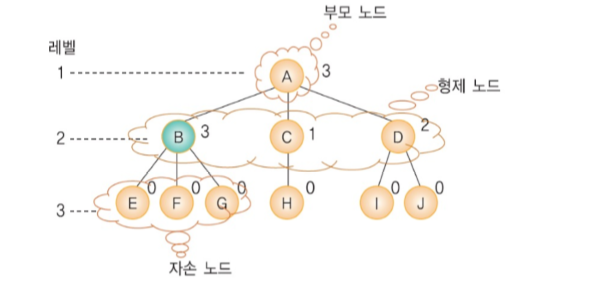
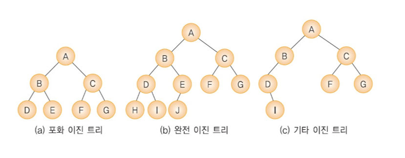

# 🌲 트리

## 📌 트리의 용어

* 레벨: 트리의 각층의 번호
* 높이: 트리의 최대 레벨
* 차수[Degree]: 노드가 가지고 있는 자식 노드의 개수

## 📌 트리의 종류
* 이진 트리[Binary Tree]
* 일반 트리

## 📌 이진 트리의 분류
* 포화 이진 트리
* 완전 이진 트리
* 기타 이진 트리

## 📌 이진 트리의 표현
* 배열을 이용하는 방법
* 포인터를 이용하는 방법

## 📌 이진 트리의 배열 표현법

## 📌 이진 트리의 링크 표헌볍

## 📌 이진 트리의 순회
* 전위순회[Preorder Traversal]
* 중위순회[Inorder Traversal]
* 후위순회[Postorder Traversal]

## 📌 레벨 순회

## 📌 이진 트리 연산: 노드 개수

## 📌 이진 트리 연산: 높이

## 📌 이진 트리 연산: 단말 노드 개수

## 📌 스레드 이진 트리[Threaded Binary Tree]

## 📌 이진 탐색 트리[Binary Search Tree]
* 순환적 방법
* 반복전 방법

## 📌 이진 트리의 삽입 연산

## 📌 이진 트리의 삭제 연산

